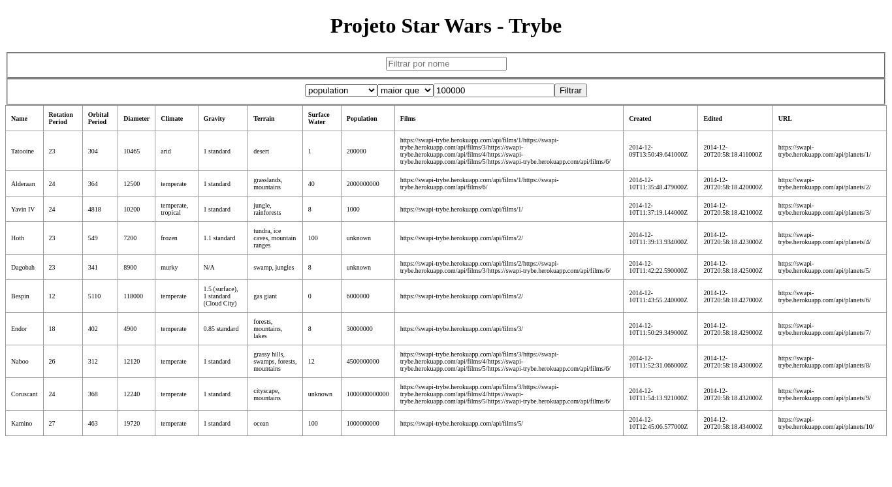

# Trybe Project Star Wars Planets Search 03/11/2021
 

  

 

## Habilidades

- Utilizar a Context API do React para gerenciar estado;
- Utilizar o React Hook useState;
- Utilizar o React Hook useContext;
- Utilizar o React Hook useEffect;
- Criar React Hooks customizados.

## Desenvolvimento
Uma [lista](https://weltonthomasferreira.github.io/trybe-project-starwars-planets-search/) com filtros de planetas do universo de Star Wars usando Context API e Hooks para controlar os estados globais.

## Resultados

- `2` dia de projeto;
- `6` requisitos;
- Percentual de cumprimento de requisitos obrigatórios `100.00%`;
- Percentual de cumprimento de requisitos totais `83.33%`.
